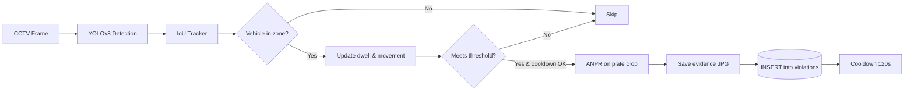

# Case 1 &mdash; Intelligent Traffic Enforcement & Behaviour Analysis (E-TLE)

Implementasi lengkap untuk **AI Open Innovation Challenge 2026 &mdash; Case 1** (Case Provider: DISHUB DKI Jakarta).

> Modul ini menambahkan lapisan **enforcement** di atas pipeline SmartTraffic AI yang sudah ada (YOLO counting + dashboard). Seluruh fungsi existing tetap berjalan; Case 1 adalah penambahan aditif.

---

## Daftar isi

1. [Ringkasan deliverable](#ringkasan-deliverable)
2. [Arsitektur](#arsitektur)
3. [Detection Pipeline](#detection-pipeline)
4. [Zone Editor](#zone-editor)
5. [ANPR (License Plate Recognition)](#anpr-license-plate-recognition)
6. [E-TLE Evidence & Database](#e-tle-evidence--database)
7. [Hotspot Heatmap](#hotspot-heatmap)
8. [Placement Recommendations (Simulator)](#placement-recommendations-simulator)
9. [CRM / Citizen Reports](#crm--citizen-reports)
10. [Executive Summary](#executive-summary)
11. [API Reference](#api-reference)
12. [Data Models](#data-models)
13. [Environment Variables](#environment-variables)
14. [File Manifest](#file-manifest)
15. [Quick Start](#quick-start)
16. [Troubleshooting](#troubleshooting)

---

## Ringkasan deliverable

Case 1 meminta 4 deliverable utama. Pemetaan ke implementasi:

| Deliverable (PDF) | Implementasi | Lokasi |
|---|---|---|
| **Model** &mdash; Automatic violation detection algorithm and license plate identification | `EnforcementEngine` + `ANPR` module | `app/services/enforcement.py`, `app/services/anpr.py` |
| **Model** &mdash; Analysis, classification and integration and automation of CRM reports | `auto_classify_crm()` + form submission + priority heuristic | `app/services/enforcement.py`, `app/routes.py` |
| **Dashboard** &mdash; Spatial-temporal violation heatmap + violator behavior statistics + integrated violation database to support E-TLE | Halaman `/enforcement` dengan Leaflet heatmap, Chart.js hour/DoW bars, violations feed, evidence viewer | `app/templates/enforcement.html` |
| **Simulator** &mdash; Recommendations for officer placement points or E-TLE camera installation based on the level of vulnerability to violations | `recommend_enforcement_points()` dengan vulnerability score | `app/database.py` |
| **Simulator** &mdash; Combination of violation types sent to the relevant unit | `dispatched_unit` field + `recommended_target_types` array per location | `app/database.py`, `/enforcement` modal |
| **Executive Summary** &mdash; Analysis of monitoring results, daily results analysis and stakeholder reports, increased public reporting participation | Halaman `/executive_summary` (printable) + endpoint `/api/violations/executive_summary` | `app/templates/executive_summary.html` |

---

## Arsitektur

```
                      +----------------+
   CCTV (RTSP/HTTP) ->| CameraAgent    |<-- Existing pipeline
                      |                |
                      |  +-----------+ |
                      |  | YOLOv8    | |
                      |  +-----+-----+ |
                      |        |       |
                      |  +-----v-----+ |
                      |  | Tracker   | |
                      |  +-----+-----+ |
                      |        |       |
                      |  +-----v-----+ |     <-- NEW in Case 1
                      |  |Enforcement| |
                      |  |Engine     | |
                      |  +-----+-----+ |
                      +--------+-------+
                               |
           +-------------------+--------------------+
           |                   |                    |
           v                   v                    v
   +--------------+   +-----------------+   +--------------+
   | ANPR         |   | Evidence JPG    |   | SQLite       |
   | (OCR fallb.) |   | data/violations |   | violations   |
   +--------------+   | _evidence/...   |   | violation_   |
                      +-----------------+   | zones        |
                                            | crm_reports  |
                                            +------+-------+
                                                   |
                                                   v
                          +--------+--------+--------+---------+--------+
                          |                                                |
                          | /enforcement  /zones  /crm  /executive_summary |
                          |         (Flask routes + Jinja templates)       |
                          +------------------------------------------------+
```

---

## Detection Pipeline



### Aturan deteksi per zone type

| Zone type | Trigger | Env var | Default |
|---|---|---|---|
| `no_parking` | dwell ≥ `ILLEGAL_PARKING_MIN_SECONDS` **AND** total movement ≤ `STATIC_MOVEMENT_PX × dwell/10` | `ILLEGAL_PARKING_MIN_SECONDS`, `STATIC_MOVEMENT_PX` | 30 s, 15 px |
| `busway` | dwell ≥ `DYNAMIC_LANE_MIN_SECONDS` | `DYNAMIC_LANE_MIN_SECONDS` | 2 s |
| `bicycle` | dwell ≥ `DYNAMIC_LANE_MIN_SECONDS` | `DYNAMIC_LANE_MIN_SECONDS` | 2 s |
| `bus_stop` | *Valid area* — tidak men-trigger violation (untuk logic PT stop di luar zona ini) | — | — |

**Point test**: yang dicek masuk zona adalah *bottom-center* dari bounding box kendaraan (perkiraan titik ban menyentuh jalan), bukan titik tengah &mdash; supaya kendaraan besar tidak salah terdeteksi saat bbox bagian atas memotong zona.

**Cooldown**: Setelah satu violation tercatat, track yang sama **tidak dicatat ulang** selama `VIOLATION_COOLDOWN_SECONDS` (default 120 s) untuk mencegah duplikasi.

---

## Zone Editor

Halaman `/zones` menyediakan UI drag-to-draw di atas live MJPEG frame dari kamera.

### Geometri yang didukung

Engine menerima dua bentuk geometri (disimpan di `geometry_json` sebagai JSON):

1. **Polygon** &mdash; `[[x1,y1], [x2,y2], ...]` &mdash; minimal 3 titik
2. **BBox** &mdash; `[x1, y1, x2, y2]` &mdash; dikonversi internal ke polygon

```python
# Contoh payload POST /api/zones
{
  "camera_id": "cam-001",
  "zone_type": "no_parking",
  "geometry": [[100, 200], [400, 200], [400, 400], [100, 400]],
  "name": "Depan Minimart",
  "active": true
}
```

### Cara pakai UI

1. Buka `/zones`
2. Pilih kamera dari dropdown → live frame muncul di canvas
3. Klik 3+ titik pada gambar untuk membentuk polygon (preview terlihat langsung)
4. Pilih *zone type* (chip di kanan atas)
5. Isi nama opsional → **Save Zone**
6. Zone langsung aktif: `EnforcementEngine` panggil `load_zones(force=True)` otomatis

Tombol helper: **Undo point** (hapus titik terakhir), **Clear**, **Refresh frame** (reload MJPEG).

---

## ANPR (License Plate Recognition)

Modul `app/services/anpr.py` implementasi **3-tier fallback**:

```
+-------------------+
|  1. easyocr       | <-- ML-based, best for angled/low-contrast plates
+-------------------+
         | (fail / not installed)
         v
+-------------------+
|  2. pytesseract   | <-- Traditional OCR + OpenCV preprocessing
+-------------------+    (grayscale + bilateral + adaptive threshold + PSM 7)
         | (fail / not installed)
         v
+-------------------+
|  3. Simulated     | <-- SHA1(camera_id:track_id) → deterministic plate
+-------------------+    (prefix by region from camera name)
```

### Regional prefix (auto dari nama kamera)

```python
{
  "jakarta": "B",  "bekasi": "B",  "tangerang": "B",  "depok": "B",
  "bogor": "F",    "sukabumi": "F", "cianjur": "F",
  "bandung": "D",
  "surabaya": "L", "malang": "N",
  "yogyakarta": "AB", "semarang": "H", "medan": "BK",
}
```

### Crop strategy

Untuk efisiensi, OCR tidak di-run di seluruh gambar. Crop diambil dari **sepertiga bawah bounding box kendaraan** (dimana plat biasanya berada), di-upscale ke minimum 120 px lebar, lalu dikirim ke OCR. Plat yang sudah terbaca sekali **di-cache per track ID** &mdash; OCR tidak berjalan di setiap frame.

### API ANPR

```python
from app.services.anpr import recognize_plate

plate, confidence, engine = recognize_plate(
    frame_bgr,        # numpy array BGR
    bbox,             # [x1, y1, x2, y2]
    region_hint="Jakarta Pusat",  # optional, untuk regional prefix
    seed="cam-001:track-42",      # optional, untuk simulated determinism
)
# engine in: "easyocr" | "tesseract" | "simulated" | "disabled" | "unavailable"
```

### Install OCR engine (opsional)

```bash
# Lightweight option
pip install pytesseract
# Plus install Tesseract binary: https://github.com/UB-Mannheim/tesseract/wiki

# More accurate but heavier (~500 MB download pertama)
pip install easyocr
```

Tanpa salah satu keduanya, sistem **tetap jalan** dengan deterministic simulated plate (ideal untuk demo).

---

## E-TLE Evidence & Database

Setiap violation menghasilkan dua artefak:

### 1. Evidence JPG

Disimpan di `data/violations_evidence/YYYY-MM-DD/<HHMMSS>_<cam>_<type>_<uid>.jpg`. File berisi full frame dengan bounding box + label pelanggaran di-overlay. Quality controllable lewat `EVIDENCE_JPEG_QUALITY` (default 85).

File di-serve lewat `GET /evidence/<relpath>`. Otomatis muncul di modal "View" pada feed violation di `/enforcement`.

### 2. Row di tabel `violations`

```sql
CREATE TABLE violations (
    id INTEGER PRIMARY KEY AUTOINCREMENT,
    camera_id TEXT NOT NULL,
    camera_name TEXT,
    zone_id INTEGER,
    zone_type TEXT NOT NULL,
    violation_type TEXT NOT NULL,
    timestamp REAL NOT NULL,
    duration_s REAL DEFAULT 0,
    vehicle_class TEXT,         -- "car" | "motorcycle" | "unknown"
    plate_text TEXT,
    plate_confidence REAL,
    bbox_json TEXT,
    evidence_path TEXT,
    lat REAL, lng REAL,
    status TEXT DEFAULT 'pending',   -- pending|dispatched|resolved|rejected
    dispatched_unit TEXT,
    notes TEXT
);
```

### Status flow

```
  [pending]  --dispatch-->  [dispatched]  --resolve-->  [resolved]
      |                         |
      +----reject------>   [rejected]
```

Operator bisa trigger transisi dari modal "View" di dashboard dengan 3 tombol: *Dispatch to Officer*, *Mark Resolved*, *Reject*.

---

## Hotspot Heatmap

Endpoint `GET /api/violations/heatmap` mengagregasi violation per kamera (dengan `lat/lng` tersedia) dan mengembalikan array untuk Leaflet.heat:

```json
{
  "status": "success",
  "points": [
    {
      "camera_id": "cam-001",
      "camera_name": "Simpang Dago",
      "lat": -6.893, "lng": 107.614,
      "count": 47,
      "by_type": {
        "illegal_parking": 31,
        "busway_occupancy": 16
      }
    }
  ]
}
```

Heatmap layer di `/enforcement` di-auto-fit ke bounds data. Circle marker klikable menampilkan breakdown per-type.

---

## Placement Recommendations (Simulator)

Fungsi `recommend_enforcement_points(top_n, start_ts, end_ts)` menghitung **vulnerability score**:

```
score = (violations_per_day) × 0.6
      + (distinct_violation_types × 2) × 0.2
      + (recent_7d_count / total_count × 10) × 0.2
```

### Output keputusan

| Score | Recommendation | Arti |
|---|---|---|
| ≥ 3.0 | `install_etle_camera` | Titik padat + beragam → pasang kamera E-TLE permanen |
| 1.0–3.0 | `officer_patrol` | Cocok untuk patroli petugas berkala |
| < 1.0 | `monitor` | Pantau saja, belum perlu intervensi aktif |

### Target type combination

Setiap rekomendasi juga memuat `recommended_target_types` (top 3 jenis pelanggaran di lokasi). Dari sini operator bisa mengirim **kombinasi violation type ke unit terkait**:
- `illegal_parking` → DISHUB Parkir
- `busway_occupancy` → TransJakarta Enforcement
- `bicycle_lane_occupancy` → DISHUB Lalin
- `illegal_pickup_dropoff` → Polantas / Dishub Angkot

---

## CRM / Citizen Reports

Halaman `/crm` menyediakan form publik dan dashboard operator.

### Auto-classifier keyword-based

```python
"busway", "transjakarta", "jalur bus"  → busway_occupancy
"sepeda", "bicycle", "bike lane"       → bicycle_lane_occupancy
"parkir liar", "illegal park", "trotoar"
                                       → illegal_parking
"ngetem", "berhenti sembarangan"       → illegal_pickup_dropoff
```

### Priority heuristic

Prioritas otomatis naik ke **high** jika description mengandung:
`kecelakaan`, `accident`, `urgent`, `segera`, `darurat`.

### Status flow

`open` → `investigating` → `resolved` → `closed`

Operator mengubah status lewat dropdown inline di tabel CRM. Summary di-update realtime.

---

## Executive Summary

Halaman `/executive_summary` adalah **printable stakeholder report** yang bisa disimpan sebagai PDF (Ctrl+P → Save as PDF). Berisi:

1. **Hero KPIs**: total violations, trend delta vs periode sebelumnya, total citizen reports
2. **Narrative bullets**: auto-generated insights dalam bahasa natural (peak hour, dominant violation type, hotspot location)
3. **Breakdown by type**: bar chart dengan persentase per violation type
4. **Top hotspots**: 8 lokasi dengan violation terbanyak
5. **Recommendations**: top 5 rekomendasi penempatan dengan action label

Period selectable: Daily (24H), Weekly (7D), Monthly (30D).

CSS `@media print` otomatis menyesuaikan layout untuk cetak (sidebar hidden, dark mode → light mode).

---

## API Reference

### Enforcement metadata

| Method | Path | Response |
|---|---|---|
| GET | `/api/enforcement/meta` | `{violation_types, zone_types}` |

### Zones

| Method | Path | Body / Query | Description |
|---|---|---|---|
| GET | `/api/zones?camera_id=X` | | List zones (optional filter) |
| POST | `/api/zones` | `{camera_id, zone_type, geometry, name?, notes?, active?}` | Create zone |
| PATCH | `/api/zones/<id>` | `{name?, zone_type?, geometry?, active?, notes?}` | Update zone |
| DELETE | `/api/zones/<id>` | | Remove zone |

### Violations

| Method | Path | Description |
|---|---|---|
| GET | `/api/violations?camera_id=&violation_type=&plate=&status=&start=&end=&limit=&offset=` | List with filters |
| GET | `/api/violations/<id>` | Single violation |
| PATCH | `/api/violations/<id>` | Update `status`, `dispatched_unit`, `notes`, `plate_text` |
| GET | `/api/violations/summary?period=24h\|7d\|30d` | Totals, by-type, by-hour, by-dow, by-camera |
| GET | `/api/violations/heatmap?period=...` | Lat/lng points for Leaflet.heat |
| GET | `/api/violations/recommendations?top_n=10` | Ranked placement recs |
| GET | `/api/violations/executive_summary?period=...` | Full exec-summary payload |
| GET | `/api/violations/export_csv?period=...&camera_id=&violation_type=` | CSV download |

### CRM

| Method | Path | Description |
|---|---|---|
| GET | `/api/crm/reports?status=&limit=&offset=` | List reports |
| POST | `/api/crm/reports` | `{description, category?, reporter_name?, reporter_contact?, lat?, lng?}` |
| PATCH | `/api/crm/reports/<id>` | Update `status`, `priority`, `auto_classified_type`, `camera_id` |
| GET | `/api/crm/summary` | Totals by status & type |

### Evidence

| Method | Path | Description |
|---|---|---|
| GET | `/evidence/<relpath>` | Serve evidence JPG |

---

## Data Models

### Table `violation_zones`

```sql
CREATE TABLE violation_zones (
    id INTEGER PRIMARY KEY AUTOINCREMENT,
    camera_id TEXT NOT NULL,
    name TEXT,
    zone_type TEXT NOT NULL,        -- no_parking|busway|bicycle|bus_stop
    geometry_json TEXT NOT NULL,    -- JSON polygon [[x,y]...] or bbox [x1,y1,x2,y2]
    active INTEGER DEFAULT 1,
    notes TEXT,
    created_ts REAL NOT NULL
);
CREATE INDEX idx_zones_camera ON violation_zones (camera_id, active);
```

### Table `violations`

```sql
CREATE TABLE violations (
    id INTEGER PRIMARY KEY AUTOINCREMENT,
    camera_id TEXT NOT NULL,
    camera_name TEXT,
    zone_id INTEGER,
    zone_type TEXT NOT NULL,
    violation_type TEXT NOT NULL,   -- illegal_parking|busway_occupancy|...
    timestamp REAL NOT NULL,
    duration_s REAL DEFAULT 0,
    vehicle_class TEXT,             -- car|motorcycle|unknown
    plate_text TEXT,
    plate_confidence REAL DEFAULT 0,
    bbox_json TEXT,                 -- JSON [x1,y1,x2,y2]
    evidence_path TEXT,             -- relative to project root
    lat REAL, lng REAL,
    status TEXT DEFAULT 'pending',  -- pending|dispatched|resolved|rejected
    dispatched_unit TEXT,
    notes TEXT
);
CREATE INDEX idx_violations_ts ON violations (timestamp);
CREATE INDEX idx_violations_cam ON violations (camera_id, timestamp);
CREATE INDEX idx_violations_type ON violations (violation_type, timestamp);
CREATE INDEX idx_violations_plate ON violations (plate_text);
```

### Table `crm_reports`

```sql
CREATE TABLE crm_reports (
    id INTEGER PRIMARY KEY AUTOINCREMENT,
    timestamp REAL NOT NULL,
    reporter_name TEXT,
    reporter_contact TEXT,
    category TEXT,
    description TEXT,
    lat REAL, lng REAL,
    camera_id TEXT,
    status TEXT DEFAULT 'open',      -- open|investigating|resolved|closed
    auto_classified_type TEXT,       -- one of VIOLATION_TYPES
    priority TEXT DEFAULT 'normal'   -- normal|high
);
CREATE INDEX idx_crm_ts ON crm_reports (timestamp);
CREATE INDEX idx_crm_status ON crm_reports (status, timestamp);
```

---

## Environment Variables

| Variable | Default | Description |
|---|---|---|
| `VIOLATIONS_ENABLED` | `1` | Master switch untuk enforcement engine |
| `ILLEGAL_PARKING_MIN_SECONDS` | `30` | Dwell minimum di zona no-parking |
| `STATIC_MOVEMENT_PX` | `15` | Batas pergerakan kendaraan supaya masih dianggap static |
| `DYNAMIC_LANE_MIN_SECONDS` | `2` | Debounce untuk busway/bicycle violations |
| `VIOLATION_COOLDOWN_SECONDS` | `120` | Cooldown per track setelah violation tercatat |
| `ANPR_ENABLED` | `1` | Master switch ANPR |
| `ANPR_FALLBACK_SIMULATE` | `1` | Gunakan deterministic plate jika OCR tidak tersedia |
| `EVIDENCE_JPEG_QUALITY` | `85` | JPG quality untuk snapshot bukti |

Set via shell sebelum run:
```bash
# Windows cmd
set ILLEGAL_PARKING_MIN_SECONDS=60 && python run.py
```

---

## File Manifest

### Ditambahkan

```
app/services/enforcement.py    # EnforcementEngine, geometry helpers, auto_classify_crm
app/services/anpr.py           # 3-tier ANPR with deterministic simulation fallback
app/templates/enforcement.html # E-TLE dashboard (heatmap + feed + charts)
app/templates/zones.html       # Polygon zone editor on live MJPEG
app/templates/crm.html         # Citizen report form + operator queue
app/templates/executive_summary.html  # Printable stakeholder report
CASE1_DOCS.md                  # File ini
```

### Diubah

```
app/config.py           # Added: VIOLATION_TYPES, ZONE_TYPES, thresholds, ANPR config
app/database.py         # Added: 3 tables + CRUD functions + summary/heatmap/recs
app/services/camera.py  # Added: EnforcementEngine integration in CameraAgent loop
app/routes.py           # Added: 16 new endpoints + 4 new pages
app/templates/base.html # Added: sidebar nav links for new pages
app/templates/documentation.html  # Added: Case 1 section with diagrams
README.md               # Added: Case 1 documentation section
```

---

## Quick Start

1. Jalankan server seperti biasa:
   ```bash
   python run.py
   ```

2. Buka `http://localhost:5000/zones`:
   - Pilih kamera dari dropdown
   - Klik 3+ titik pada frame untuk gambar polygon
   - Pilih zone type (no_parking / busway / bicycle / bus_stop)
   - Beri nama (opsional) → **Save Zone**

3. Tunggu kendaraan memasuki zona:
   - `no_parking`: kendaraan harus diam ≥30s (default)
   - `busway`/`bicycle`: kendaraan lewat ≥2s
   - Violation tercatat otomatis dengan snapshot + ANPR

4. Buka `/enforcement`:
   - Lihat heatmap, KPIs, charts
   - Klik **View** pada row violation → modal dengan evidence JPG
   - Dispatch / Resolve / Reject

5. Buka `/crm`:
   - Submit laporan dari form → auto-classified
   - Kelola status dari tabel operator

6. Buka `/executive_summary`:
   - Pilih periode (24H/7D/30D)
   - Klik **Print / Save PDF** → laporan stakeholder siap

---

## Troubleshooting

### "Evidence image not showing"

- Cek `data/violations_evidence/YYYY-MM-DD/*.jpg` ada file-nya
- Cek `violations.evidence_path` di DB &mdash; harus relative path yang bisa dijangkau `/evidence/<path>`

### "No violations being detected"

- Pastikan zone sudah terdefinisi di `/zones` untuk kamera yang aktif
- Pastikan `VIOLATIONS_ENABLED=1`
- Cek `CameraAgent` sedang di-capture frame (bukan mode simulated) &mdash; lihat status agent di `/dashboard`
- Untuk illegal parking, kendaraan harus diam ≥30 detik (bisa diturunkan dengan env `ILLEGAL_PARKING_MIN_SECONDS=5` untuk testing)

### "All plates look like simulated"

- Engine = `simulated` artinya OCR library tidak terinstall
- Install salah satu: `pip install pytesseract` atau `pip install easyocr`
- Untuk pytesseract, butuh Tesseract binary terpasang di PATH

### "Heatmap kosong"

- Heatmap butuh violation yang memiliki `lat/lng` non-null
- `lat/lng` di-populate otomatis dari konfigurasi kamera (`cctv_config.json`)
- Cek konfigurasi kamera: `SELECT camera_id, lat, lng FROM ... ` &mdash; atau lihat `/api/sources`

### "Recommendations empty"

- Rekomendasi butuh data historis violation (default 30 hari)
- Untuk demo: jalankan sistem beberapa saat atau insert data sintetis lewat API/DB

### "Tidak bisa draw zone"

- Cek browser console untuk error JS
- Pastikan `/video_feed/<cam_id>` return MJPEG (bukan 404)
- Frame harus fully loaded (`img.onload` fired) sebelum klik

---

*Dokumen ini berkorespondensi dengan commit yang menambahkan fitur Case 1 ke repo `big-data-traffict-competitiom`.*
