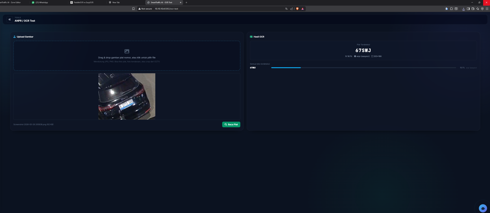

# 📋 Dokumentasi Sistem SmartTraffic AI — Asterion

> **AI Open Innovation Challenge 2026 — Case 1: DISHUB DKI Jakarta**
> *Intelligent Traffic Enforcement & Behaviour Analysis (E-TLE)*
> **Tim: Asterion**

---

## Daftar Isi

1. [Gambaran Umum Sistem](#1-gambaran-umum-sistem)
2. [Arsitektur Sistem](#2-arsitektur-sistem)
3. [Alur Kerja (Pipeline)](#3-alur-kerja-pipeline)
4. [Komponen Utama](#4-komponen-utama)
5. [Sistem Deteksi Kendaraan (YOLO)](#5-sistem-deteksi-kendaraan-yolo)
6. [Sistem Tracking Kendaraan](#6-sistem-tracking-kendaraan)
7. [Enforcement Engine (E-TLE)](#7-enforcement-engine-e-tle)
8. [ANPR — Pengenalan Plat Nomor](#8-anpr--pengenalan-plat-nomor)
9. [Database & Penyimpanan Data](#9-database--penyimpanan-data)
10. [API Reference](#10-api-reference)
11. [Halaman Web (Frontend)](#11-halaman-web-frontend)
12. [Autentikasi & Otorisasi](#12-autentikasi--otorisasi)
13. [Konfigurasi Sistem](#13-konfigurasi-sistem)
14. [Training Model Custom](#14-training-model-custom)
15. [Cara Menjalankan](#15-cara-menjalankan)
16. [Troubleshooting](#16-troubleshooting)

---

## 1. Gambaran Umum Sistem

**SmartTraffic AI** adalah solusi **Edge/IoT Big Data** untuk:

- **Monitoring lalu lintas real-time** dari CCTV (RTSP/HTTP/file video)
- **Deteksi & klasifikasi kendaraan** menggunakan YOLOv8/v11 (mobil, motor, bus, truk, dll.)
- **Penegakan hukum otomatis (E-TLE)** — deteksi parkir liar, pelanggaran jalur busway/sepeda
- **Pengenalan plat nomor (ANPR)** — OCR otomatis untuk bukti tilang elektronik
- **Prediksi lalu lintas** — forecasting berbasis pola historis + Transformer neural network
- **Dashboard interaktif** — peta Leaflet, grafik Chart.js, live video stream
- **Laporan eksekutif** — ringkasan harian/mingguan/bulanan untuk stakeholder

### Metrik Sistem

| Aspek | Nilai |
|-------|-------|
| Data Points | 3.5M+ historis |
| Stream Aktif | Hingga 37 kamera simultan |
| Latency Inference | < 500ms per frame |
| Uptime Target | 99.9% |

---

## 2. Arsitektur Sistem

Sistem mengikuti arsitektur **pipeline 4 tahap**:

```
┌─────────────────────────────────────────────────────────────────────────────┐
│                        ARSITEKTUR SmartTraffic AI                            │
├─────────────────────────────────────────────────────────────────────────────┤
│                                                                             │
│  ┌──────────────┐    ┌──────────────────┐    ┌──────────────────┐          │
│  │ CCTV Sources │───>│  Camera Agents   │───>│  YOLO Inference  │          │
│  │ (RTSP/HTTP)  │    │  (Multi-thread)  │    │  (GPU/CPU/ONNX)  │          │
│  └──────────────┘    └──────────────────┘    └────────┬─────────┘          │
│                                                        │                    │
│                                                        ▼                    │
│  ┌──────────────────────────────────────────────────────────────────┐      │
│  │                    PROCESSING LAYER                                │      │
│  │  ┌─────────────┐  ┌──────────────────┐  ┌────────────────────┐  │      │
│  │  │ IoU Tracker │  │ Enforcement Eng. │  │ ANPR (Plate OCR)   │  │      │
│  │  │ (per-frame) │  │ (zone + dwell)   │  │ (PaddleOCR/Easy/T) │  │      │
│  │  └──────┬──────┘  └────────┬─────────┘  └─────────┬──────────┘  │      │
│  └─────────┼──────────────────┼───────────────────────┼─────────────┘      │
│            │                  │                       │                     │
│            ▼                  ▼                       ▼                     │
│  ┌──────────────────────────────────────────────────────────────────┐      │
│  │                    STORAGE LAYER                                   │      │
│  │  ┌──────────┐  ┌──────────────┐  ┌────────────┐  ┌───────────┐  │      │
│  │  │ SQLite   │  │ Data Lake    │  │ Evidence   │  │ In-Memory │  │      │
│  │  │ (DB)     │  │ (CSV/daily)  │  │ (JPG)      │  │ (deque)   │  │      │
│  │  └──────────┘  └──────────────┘  └────────────┘  └───────────┘  │      │
│  └──────────────────────────────────────────────────────────────────┘      │
│            │                                                                │
│            ▼                                                                │
│  ┌──────────────────────────────────────────────────────────────────┐      │
│  │                    PRESENTATION LAYER                              │      │
│  │  ┌──────────┐  ┌──────────────┐  ┌────────────┐  ┌───────────┐  │      │
│  │  │ REST API │  │ Dashboard    │  │ Enforcement│  │ Exec.     │  │      │
│  │  │ (JSON)   │  │ (Leaflet)   │  │ (Heatmap)  │  │ Summary   │  │      │
│  │  └──────────┘  └──────────────┘  └────────────┘  └───────────┘  │      │
│  └──────────────────────────────────────────────────────────────────┘      │
└─────────────────────────────────────────────────────────────────────────────┘
```

### Struktur Folder Proyek

```
big-data-traffict-competitiom/
├── run.py                    # Entry point — jalankan server Flask
├── README.md                 # Dokumentasi ringkas (English)
├── CASE1_DOCS.md             # Dokumentasi lengkap Case 1 E-TLE
├── requirements.txt          # Dependencies Python
├── app/                      # Aplikasi utama
│   ├── __init__.py           # Flask app factory (create_app)
│   ├── config.py             # Semua konfigurasi sistem
│   ├── globals.py            # Shared state (thread-safe)
│   ├── database.py           # SQLite layer + Transformer forecaster
│   ├── routes.py             # API endpoints + halaman web
│   ├── utils.py              # Utility (load/save config, backfill, dll.)
│   ├── auth.py               # Autentikasi (admin/operator)
│   ├── services/
│   │   ├── camera.py         # CameraAgent + YOLO inference + tracking
│   │   ├── enforcement.py    # EnforcementEngine (deteksi pelanggaran)
│   │   └── anpr.py           # ANPR (pengenalan plat nomor)
│   └── templates/            # HTML templates (Jinja2)
│       ├── base.html         # Layout dasar + sidebar
│       ├── dashboard.html    # Dashboard utama (peta + grafik)
│       ├── enforcement.html  # E-TLE dashboard (heatmap + feed)
│       ├── zones.html        # Editor zona pelanggaran (polygon)
│       ├── crm.html          # Form laporan masyarakat
│       ├── executive_summary.html  # Laporan stakeholder (printable)
│       ├── cameras.html      # Manajemen kamera
│       ├── operator.html     # View khusus operator
│       ├── analysis.html     # Analisis lalu lintas
│       ├── documentation.html # Dokumentasi dalam UI
│       ├── settings.html     # Pengaturan sistem
│       ├── login.html        # Halaman login
│       ├── ocr_test.html     # Testing OCR/ANPR
│       └── index.html        # Landing page
├── scripts/                  # Script utilitas & training
│   ├── train_vehicle_yolo.py # Training YOLO custom (6 kelas kendaraan)
│   ├── train_plate_detector.py # Training model deteksi plat
│   ├── prepare_vehicle_dataset.py # Persiapan dataset Roboflow
│   ├── analyze_thresholds.py # Analisis threshold optimal
│   ├── export_data.py        # Export data ke CSV
│   ├── migrate_stats.py      # Migrasi format statistik
│   ├── sync_stats_db.py      # Sinkronisasi stats ↔ DB
│   └── syntetic.py           # Generator data sintetis
├── models/                   # Model AI
│   ├── vehicle_v3_best.pt    # Custom YOLO (6 kelas Indonesia)
│   ├── plate_detector_best.pt # Deteksi lokasi plat
│   └── vehicle-detection.v3i.yolov8/ # Dataset training
├── data/                     # Data runtime
│   ├── cctv_config.json      # Konfigurasi kamera
│   ├── traffic_stats.json    # Statistik persisten
│   ├── traffic_data.db       # SQLite database
│   └── violations_evidence/  # Bukti pelanggaran (JPG)
├── data_lake/                # Big Data Lake (CSV partitioned)
│   └── raw/YYYY/MM/DD/       # Partisi harian
├── docs/                     # Dokumentasi tambahan
└── .deps/                    # Vendored dependencies
```

---

## 3. Alur Kerja (Pipeline)

### 3.1 Alur Startup Aplikasi

```
python run.py
    │
    ├── 1. Print banner "ASTERION Smart Traffic AI"
    ├── 2. Deteksi GPU (Torch CUDA / OpenCV DNN CUDA)
    ├── 3. create_app()
    │       ├── load_config() → baca cctv_config.json
    │       ├── load_stats() → baca traffic_stats.json
    │       ├── init_db() → buat tabel SQLite jika belum ada
    │       ├── sync_stats_with_config() → hapus zombie entries
    │       ├── warm_history_from_db(24h) → isi in-memory dari DB
    │       └── recover_downtime_gaps() → isi gap jika app sempat mati
    │
    ├── 4. start_camera_agents()
    │       ├── Load model YOLO (prioritas: custom → COCO → ONNX → simulasi)
    │       ├── Set class mapping (custom 6 kelas ATAU COCO subset)
    │       └── Spawn CameraAgent thread per kamera aktif
    │
    └── 5. app.run(host=0.0.0.0, port=5002)
            └── Flask server siap menerima request
```

### 3.2 Alur Per-Frame (CameraAgent)

Setiap `CameraAgent` berjalan sebagai **daemon thread** independen:

```
Loop setiap ~33ms (30 FPS untuk view aktif, 1 FPS untuk background):
    │
    ├── 1. CAPTURE FRAME
    │       ├── Coba OpenCV VideoCapture (RTSP/HTTP/file)
    │       ├── Fallback: FFmpeg subprocess (grab 1 frame)
    │       └── Jika file video lokal → auto-loop (replay)
    │
    ├── 2. INFERENCE (setiap N frame, default skip=4 → setiap frame ke-5)
    │       ├── YOLO model(frame, conf=0.35, iou=0.50, imgsz=640)
    │       ├── Filter: hanya kelas kendaraan (car, motor, bus, truck, dll.)
    │       └── Output: list of {class_id, confidence, bbox [x1,y1,x2,y2]}
    │
    ├── 3. TRACKING (IoU-based)
    │       ├── Match deteksi baru dengan track existing (IoU ≥ 0.20)
    │       ├── Track baru dibuat untuk deteksi yang tidak match
    │       ├── Track expired dihapus (TTL = 10 detik tanpa re-deteksi)
    │       └── Output: jumlah kendaraan baru (untuk akumulasi)
    │
    ├── 4. ENFORCEMENT CHECK (jika model aktif + frame valid)
    │       ├── EnforcementEngine.check_frame(frame, tracks, timestamp)
    │       ├── Cek setiap track: apakah center-nya di dalam zona?
    │       ├── Jika ya: update dwell time + movement tracking
    │       ├── Jika threshold terpenuhi → VIOLATION DETECTED
    │       │       ├── Jalankan ANPR (baca plat nomor)
    │       │       ├── Simpan evidence JPG
    │       │       └── INSERT ke tabel violations
    │       └── Cooldown 120 detik per track (anti-duplikasi)
    │
    ├── 5. UPDATE STATISTICS
    │       ├── Update global_stats[camera_id] (current_count, class_counts)
    │       ├── Append ke history deque (in-memory, max 50.000 entries)
    │       ├── INSERT ke SQLite traffic_history (throttled: max 1x per 2 detik)
    │       └── Save stats ke JSON (throttled: max 1x per 60 detik)
    │
    ├── 6. DATA LAKE LOGGING (throttled: max 1x per 5 detik)
    │       └── Tulis CSV ke data_lake/raw/YYYY/MM/DD/traffic_log_<cam>.csv
    │
    └── 7. RENDER FRAME (hanya untuk kamera yang sedang ditampilkan)
            ├── Draw bounding boxes (hijau=mobil, biru=motor)
            ├── Draw zona pelanggaran (polyline berwarna)
            ├── Draw violation markers (kotak merah + label)
            ├── Overlay: nama kamera, total count, watermark
            └── Update g.outputFrame → di-stream via MJPEG
```

---

## 4. Komponen Utama

### 4.1 `app/config.py` — Pusat Konfigurasi

Semua parameter sistem terpusat di sini. Bisa di-override via environment variable.

| Kategori | Parameter Penting | Default | Fungsi |
|----------|-------------------|---------|--------|
| Path | `BASE_DIR`, `DATA_DIR`, `MODELS_DIR` | Auto-detect | Lokasi file |
| Server | `HOST_IP`, `HOST_PORT` | `0.0.0.0:5002` | Binding Flask |
| YOLO | `CONF_THRESHOLD` | 0.35 | Minimum confidence deteksi |
| YOLO | `IOU_THRESHOLD` | 0.50 | NMS IoU threshold |
| YOLO | `INFER_IMGSZ` | 640 | Resolusi input inference |
| YOLO | `INFER_SKIP_FRAMES` | 4 | Skip N frame antar inference |
| Stream | `STREAM_FPS` | 30 | Target FPS video stream |
| Stream | `STREAM_JPEG_QUALITY` | 75 | Kualitas MJPEG output |
| Stream | `STREAM_MAX_WIDTH` | 960 | Max lebar frame stream |
| Enforcement | `ILLEGAL_PARKING_MIN_SECONDS` | 60 | Detik diam = parkir liar |
| Enforcement | `STATIC_MOVEMENT_PX` | 300 | Max displacement (px) |
| Enforcement | `DYNAMIC_LANE_MIN_SECONDS` | 2 | Debounce busway/sepeda |
| Enforcement | `VIOLATION_COOLDOWN_SECONDS` | 120 | Anti-duplikasi per track |
| ANPR | `ANPR_ENABLED` | true | Master switch OCR |
| ANPR | `ANPR_FALLBACK_SIMULATE` | false | Plat simulasi jika OCR gagal |

### 4.2 `app/globals.py` — Shared State

State global yang diakses oleh semua thread (thread-safe via locks):

```python
global_stats = {}        # Dict: camera_id → {name, current_count, history, ...}
CCTV_SOURCES = []        # List konfigurasi kamera dari JSON
camera_agents = {}       # Dict: camera_id → CameraAgent instance
VIDEO_SOURCE = ""        # URL kamera yang sedang ditampilkan
outputFrame = None       # Frame terakhir untuk MJPEG stream
lock = threading.Lock()  # Lock untuk outputFrame
model_lock = threading.Lock()  # Lock untuk akses model YOLO
```

### 4.3 `app/__init__.py` — App Factory

Fungsi `create_app()` melakukan inisialisasi:
1. Load konfigurasi kamera dari `cctv_config.json`
2. Load statistik persisten dari `traffic_stats.json`
3. Inisialisasi database SQLite (create tables)
4. Sinkronisasi stats dengan config (hapus kamera yang sudah dihapus)
5. Warm-up history dari DB (24 jam terakhir ke memory)
6. Recovery gap downtime (background thread)
7. Register Flask Blueprint (routes)

---

## 5. Sistem Deteksi Kendaraan (YOLO)

### 5.1 Model yang Didukung

Sistem mendukung beberapa model dengan **prioritas loading**:

```
Prioritas (dari tinggi ke rendah):
1. Custom Model (vehicle_v3_best.pt) — 6 kelas kendaraan Indonesia
   ↓ (jika tidak ada)
2. Generic COCO (yolo11m.pt / yolov8l.pt) — subset kelas kendaraan
   ↓ (jika tidak ada)
3. ONNX Fallback (yolov5n.onnx via OpenCV DNN) — ringan, CPU-friendly
   ↓ (jika semua gagal)
4. Simulation Mode — tanpa model, generate data sintetis
```

### 5.2 Custom Model (6 Kelas Kendaraan Indonesia)

Dilatih menggunakan dataset **Roboflow Vehicle Detection v3**:

| Index | Kelas | Mapping Internal |
|-------|-------|-----------------|
| 0 | Bus | → Car (kendaraan besar) |
| 1 | Car | → Car |
| 2 | Microbus | → Car |
| 3 | Motorbike | → Motorcycle |
| 4 | Pickup-van | → Car |
| 5 | Truck | → Car (kendaraan besar) |

### 5.3 COCO Model (Subset Kendaraan)

Menggunakan kelas COCO standar:

| COCO ID | Kelas | Mapping Internal |
|---------|-------|-----------------|
| 1 | Bicycle | → Motorcycle |
| 2 | Car | → Car |
| 3 | Motorcycle | → Motorcycle |
| 5 | Bus | → Car |
| 7 | Truck | → Car |

### 5.4 GPU Acceleration

```
Deteksi otomatis saat startup:
├── Torch CUDA tersedia? → Load YOLO dengan GPU (tercepat)
├── OpenCV DNN CUDA tersedia? → Load ONNX dengan CUDA backend
└── Tidak ada GPU → CPU mode (lebih lambat tapi tetap jalan)
```

### 5.5 YoloDnnEngine (Fallback ONNX)

Kelas `YoloDnnEngine` di `camera.py` menggunakan OpenCV DNN untuk inference ONNX:
- Input: frame BGR → blob 640×640
- Output: deteksi dengan NMS
- Mendukung CUDA jika OpenCV di-build dengan CUDA support

---

## 6. Sistem Tracking Kendaraan

### 6.1 Algoritma IoU Tracker

Tracking berbasis **Intersection over Union (IoU)** antar frame:

```
Frame N:   [Det_A, Det_B, Det_C]     (deteksi YOLO)
                    ↕ IoU matching
Frame N-1: [Track_1, Track_2]         (track existing)

Aturan:
- IoU ≥ 0.20 → match (track di-update dengan posisi baru)
- Tidak match → buat track baru (kendaraan baru masuk frame)
- Track tidak terdeteksi > 10 detik → hapus (kendaraan keluar)
```

### 6.2 Properti Track

Setiap track menyimpan:
- `box`: bounding box terakhir [x1, y1, x2, y2]
- `class_id`: kelas kendaraan (0=Car, 1=Motorcycle)
- `last_seen`: timestamp terakhir terdeteksi
- `counted`: flag sudah dihitung

### 6.3 Counting Logic

- **Current Count**: jumlah track aktif saat ini (kendaraan dalam frame)
- **New Count**: jumlah track baru yang dibuat (kendaraan baru masuk)
- **Accumulated Count**: total kendaraan yang pernah terdeteksi (kumulatif)

---

## 7. Enforcement Engine (E-TLE)

### 7.1 Konsep Dasar

`EnforcementEngine` (satu instance per kamera) mendeteksi pelanggaran lalu lintas
secara otomatis berdasarkan:
- **Zona pelanggaran** yang didefinisikan admin (polygon di atas frame CCTV)
- **Dwell time** — berapa lama kendaraan berada di dalam zona
- **Movement analysis** — apakah kendaraan benar-benar diam (statis)

### 7.2 Tipe Zona

| Zona | Kode | Pelanggaran yang Dideteksi |
|------|------|---------------------------|
| Dilarang Parkir | `no_parking` | Kendaraan diam ≥60 detik |
| Jalur Busway | `busway` | Kendaraan non-bus masuk ≥2 detik |
| Jalur Sepeda | `bicycle` | Kendaraan bermotor masuk ≥2 detik |
| Halte Bus | `bus_stop` | *Tidak trigger violation* (zona valid) |

### 7.3 Alur Deteksi Pelanggaran

```
Setiap inference frame:
    │
    ├── 1. Load zona dari DB (refresh setiap 30 detik)
    │
    ├── 2. Untuk setiap YOLO track yang aktif:
    │       ├── Hitung center point bbox
    │       ├── Cek: apakah center ada di dalam polygon zona?
    │       │       └── Menggunakan ray-casting algorithm (point-in-polygon)
    │       │
    │       ├── JIKA DI DALAM ZONA:
    │       │       ├── Track baru? → Buat _TrackViolationState
    │       │       └── Track existing? → Update last_seen + posisi
    │       │
    │       └── JIKA DI LUAR ZONA:
    │               └── Jika sudah > 10 detik di luar → hapus state
    │
    ├── 3. Cek threshold pelanggaran:
    │       │
    │       ├── ZONA NO_PARKING:
    │       │       ├── dwell ≥ 60 detik? ✓
    │       │       ├── Kendaraan statis? (max displacement ≤ 25px) ✓
    │       │       ├── Avg frame-to-frame movement ≤ 8px? ✓
    │       │       ├── Tidak ada single jump > 20px? ✓
    │       │       └── SEMUA terpenuhi → VIOLATION!
    │       │
    │       └── ZONA BUSWAY/BICYCLE:
    │               ├── dwell ≥ 2 detik? ✓
    │               ├── Kendaraan statis? ✓
    │               └── SEMUA terpenuhi → VIOLATION!
    │
    └── 4. Jika VIOLATION terdeteksi:
            ├── Jalankan ANPR (baca plat nomor)
            ├── Simpan evidence JPG (frame + bbox overlay)
            ├── INSERT ke database (tabel violations)
            ├── Set cooldown 120 detik untuk track ini
            └── Return violation record ke CameraAgent
```

### 7.4 Analisis Stasioneritas (Is Stationary?)

Kendaraan dianggap **benar-benar diam** HANYA jika:

1. **Minimal 5 sampel posisi** tersedia (cukup data)
2. **Max displacement dari posisi awal ≤ 25px** (tidak bergeser)
3. **Rata-rata pergerakan antar-frame ≤ 8px** (hanya jitter YOLO)
4. **Tidak ada single jump > 20px** (tidak ada gerakan tiba-tiba)

> **Catatan**: YOLO bounding box pada kendaraan yang benar-benar parkir
> biasanya "jitter" 3-8px per frame karena variasi deteksi. Threshold
> di atas mengakomodasi jitter ini tanpa false positive.

### 7.5 Size Filter (Anti False Positive)

Sebelum kendaraan dicek masuk zona, ada filter ukuran:
- Lebar bbox minimum: 80px
- Tinggi bbox minimum: 60px
- Area minimum: 8.000 px²
- Aspect ratio: lebar/tinggi ≥ 0.5

Ini mencegah objek kecil (pejalan kaki, artefak) memicu pelanggaran.

### 7.6 Evidence & Bukti

Setiap pelanggaran menghasilkan:
- **File JPG** di `data/violations_evidence/YYYY-MM-DD/HHMMSS_<cam>_<type>_<uid>.jpg`
- Frame lengkap dengan bounding box merah + label pelanggaran
- Timestamp overlay di pojok bawah
- Kualitas: 85% JPEG (configurable)

### 7.7 Status Flow Pelanggaran

```
[pending] ──dispatch──> [dispatched] ──resolve──> [resolved]
    │                        │
    └────reject────>    [rejected]
```

Operator mengubah status dari modal "View" di dashboard enforcement.

---

## 8. ANPR — Pengenalan Plat Nomor

### 8.1 Pipeline ANPR

```
Vehicle BBox dari YOLO
    │
    ├── 1. DETEKSI LOKASI PLAT (jika plate_detector_best.pt tersedia)
    │       └── YOLO plate detector → crop presisi area plat
    │
    ├── 2. FALLBACK: Estimasi heuristik
    │       ├── Kandidat 1: 35% bawah bbox (plat belakang)
    │       ├── Kandidat 2: 35% atas bbox (plat depan, kamera top-down)
    │       ├── Kandidat 3: Strip tengah (kamera miring)
    │       └── Pilih kandidat dengan kontras tertinggi (std dev grayscale)
    │
    ├── 3. PREPROCESSING
    │       ├── Upscale ke minimum 200px lebar
    │       ├── CLAHE (adaptive contrast enhancement)
    │       └── Sharpening kernel
    │
    └── 4. OCR (4-tier fallback)
            ├── Tier 1: PaddleOCR (terbaik, support angle detection)
            ├── Tier 2: EasyOCR (ML-based, bagus untuk low-contrast)
            ├── Tier 3: Pytesseract + preprocessing (traditional OCR)
            └── Tier 4: Simulated (deterministic pseudo-plate, DISABLED default)
```

### 8.2 Regional Plate Prefix

Sistem otomatis menentukan prefix plat berdasarkan nama kamera:

| Wilayah | Prefix | Contoh |
|---------|--------|--------|
| Jakarta, Bekasi, Tangerang, Depok | B | B 1234 ABC |
| Bogor, Sukabumi, Cianjur | F | F 5678 XY |
| Bandung | D | D 912 KLM |
| Surabaya | L | L 4567 DEF |
| Malang | N | N 8901 GH |
| Yogyakarta | AB | AB 2345 IJK |
| Semarang | H | H 6789 LMN |
| Medan | BK | BK 1234 OP |

### 8.3 Caching

- Plat yang sudah terbaca **di-cache per track ID**
- OCR tidak dijalankan ulang setiap frame (hemat resource)
- Hanya dijalankan sekali saat violation pertama kali terdeteksi

---

## 9. Database & Penyimpanan Data

### 9.1 SQLite Database (`data/traffic_data.db`)

#### Tabel `traffic_history`
Menyimpan data counting per kamera per waktu:

| Kolom | Tipe | Deskripsi |
|-------|------|-----------|
| id | INTEGER PK | Auto-increment |
| camera_id | TEXT | ID kamera |
| timestamp | REAL | Unix timestamp |
| total_count | INTEGER | Jumlah kendaraan saat itu |
| cars | INTEGER | Jumlah mobil |
| motorcycles | INTEGER | Jumlah motor |
| new_count | INTEGER | Kendaraan baru (akumulasi) |
| new_cars | INTEGER | Mobil baru |
| new_motorcycles | INTEGER | Motor baru |

#### Tabel `violation_zones`
Definisi zona pelanggaran:

| Kolom | Tipe | Deskripsi |
|-------|------|-----------|
| id | INTEGER PK | Auto-increment |
| camera_id | TEXT | ID kamera |
| name | TEXT | Nama zona (opsional) |
| zone_type | TEXT | no_parking / busway / bicycle / bus_stop |
| geometry_json | TEXT | JSON polygon [[x,y]...] atau bbox [x1,y1,x2,y2] |
| active | INTEGER | 1=aktif, 0=nonaktif |
| notes | TEXT | Catatan |
| created_ts | REAL | Timestamp pembuatan |

#### Tabel `violations`
Record pelanggaran yang terdeteksi:

| Kolom | Tipe | Deskripsi |
|-------|------|-----------|
| id | INTEGER PK | Auto-increment |
| camera_id | TEXT | ID kamera |
| camera_name | TEXT | Nama kamera |
| zone_id | INTEGER | FK ke violation_zones |
| zone_type | TEXT | Tipe zona |
| violation_type | TEXT | Jenis pelanggaran |
| timestamp | REAL | Waktu kejadian |
| duration_s | REAL | Durasi pelanggaran (detik) |
| vehicle_class | TEXT | car / motorcycle / unknown |
| plate_text | TEXT | Nomor plat (hasil OCR) |
| plate_confidence | REAL | Confidence OCR (0-1) |
| bbox_json | TEXT | Bounding box JSON |
| evidence_path | TEXT | Path ke file bukti JPG |
| lat, lng | REAL | Koordinat lokasi |
| status | TEXT | pending / dispatched / resolved / rejected |
| dispatched_unit | TEXT | Unit yang ditugaskan |
| notes | TEXT | Catatan operator |

#### Tabel `crm_reports`
Laporan masyarakat (CRM):

| Kolom | Tipe | Deskripsi |
|-------|------|-----------|
| id | INTEGER PK | Auto-increment |
| timestamp | REAL | Waktu laporan |
| reporter_name | TEXT | Nama pelapor |
| reporter_contact | TEXT | Kontak pelapor |
| category | TEXT | Kategori manual |
| description | TEXT | Deskripsi laporan |
| lat, lng | REAL | Lokasi kejadian |
| camera_id | TEXT | Kamera terkait |
| status | TEXT | open / investigating / resolved / closed |
| auto_classified_type | TEXT | Klasifikasi otomatis (keyword-based) |
| priority | TEXT | normal / high |

### 9.2 Data Lake (CSV Partitioned)

Lokasi: `data_lake/raw/YYYY/MM/DD/traffic_log_<camera_id>.csv`

Format CSV:
```csv
timestamp,source_id,source_name,class_id,confidence,bbox
1716900000.5,cam-001,Simpang Dago,0,0.8723,"[120, 340, 280, 450]"
```

Partisi per hari memungkinkan:
- Query historis efisien (scan hanya folder tanggal tertentu)
- Archival mudah (compress/hapus folder lama)
- Kompatibel dengan tools Big Data (Spark, Pandas)

### 9.3 In-Memory Cache

- `global_stats[camera_id]["history"]` = `deque(maxlen=50000)`
- Menyimpan ~24 jam data per kamera (interval 2 detik)
- Digunakan untuk grafik real-time di dashboard
- Di-warm dari DB saat startup

### 9.4 Prediksi Lalu Lintas

#### Metode 1: Historical Pattern Replay
- Rata-rata volume per Day-of-Week + Hour
- Contoh: prediksi Senin jam 08:00 = rata-rata semua Senin jam 08:00 di DB

#### Metode 2: Transformer Neural Network (jika PyTorch tersedia)
- `_TinyTransformerForecaster`: model kecil (d_model=32, 4 heads, 2 layers)
- Input: 48 jam terakhir (hourly buckets) + embedding hour + day-of-week
- Output: prediksi volume jam berikutnya
- Auto-train dari data historis (minimal 96 data points)

---

## 10. API Reference

### 10.1 Traffic Monitoring

| Method | Path | Deskripsi |
|--------|------|-----------|
| GET | `/api/stats` | Statistik real-time semua kamera |
| GET | `/api/history?camera_id=X&hours=24` | Data historis |
| GET | `/api/predict_traffic?camera_id=X&target_time=...` | Prediksi |
| GET | `/api/sources` | Daftar kamera + koordinat |
| POST | `/api/add_source` | Tambah kamera baru |
| POST | `/api/edit_camera` | Edit konfigurasi kamera |
| POST | `/api/remove_source` | Hapus kamera |
| POST | `/api/reset_data` | Reset statistik |
| GET | `/metrics` | Prometheus-style metrics |
| GET | `/export/csv` | Export data ke CSV |

### 10.2 Enforcement (E-TLE)

| Method | Path | Deskripsi |
|--------|------|-----------|
| GET | `/api/enforcement/meta` | Metadata (zone_types, violation_types) |
| GET/POST | `/api/zones` | List atau buat zona baru |
| PATCH/DELETE | `/api/zones/<id>` | Edit atau hapus zona |
| GET | `/api/violations` | List pelanggaran (filter: camera, type, plate, status, time) |
| GET/PATCH | `/api/violations/<id>` | Detail / update status pelanggaran |
| GET | `/api/violations/summary` | Ringkasan (totals, by-type, by-hour, by-dow) |
| GET | `/api/violations/heatmap` | Data heatmap (lat/lng + count) |
| GET | `/api/violations/recommendations` | Rekomendasi penempatan petugas/kamera |
| GET | `/api/violations/export_csv` | Export pelanggaran ke CSV |
| GET | `/api/violations/executive_summary` | Payload laporan eksekutif |

### 10.3 CRM (Laporan Masyarakat)

| Method | Path | Deskripsi |
|--------|------|-----------|
| GET/POST | `/api/crm/reports` | List atau submit laporan |
| PATCH | `/api/crm/reports/<id>` | Update status/prioritas |
| GET | `/api/crm/summary` | Ringkasan per status & tipe |

### 10.4 Lainnya

| Method | Path | Deskripsi |
|--------|------|-----------|
| GET | `/video_feed/<camera_id>` | MJPEG live stream |
| GET | `/evidence/<path>` | Serve file bukti JPG |
| POST | `/api/chat` | Chat AI (Ollama integration) |
| POST | `/login` | Autentikasi |
| GET | `/logout` | Logout |

---

## 11. Halaman Web (Frontend)

| Path | Halaman | Deskripsi |
|------|---------|-----------|
| `/` | Index | Landing page |
| `/login` | Login | Form autentikasi |
| `/dashboard` | Dashboard | Peta Leaflet + grafik + kartu kamera + live stream |
| `/enforcement` | E-TLE Dashboard | KPI, heatmap pelanggaran, grafik jam/hari, feed violation, evidence viewer |
| `/zones` | Zone Editor | Gambar polygon zona di atas live MJPEG frame |
| `/crm` | CRM | Form laporan masyarakat + antrian operator |
| `/executive_summary` | Laporan Eksekutif | Printable report (Ctrl+P → PDF) |
| `/cameras` | Manajemen Kamera | CRUD kamera, koordinat, URL |
| `/operator` | Operator View | View khusus role operator |
| `/analysis` | Analisis | Analisis lalu lintas mendalam |
| `/settings` | Pengaturan | Konfigurasi sistem |
| `/documentation` | Dokumentasi | Dokumentasi dalam UI (arsitektur, 4V Big Data) |
| `/ocr_test` | OCR Test | Testing ANPR/OCR |

### Fitur Dashboard Utama

- **Peta Leaflet** dengan marker kamera berwarna (hijau/kuning/merah = sepi/sedang/ramai)
- **Popup** per marker: nama, status, jumlah kendaraan, cuaca real-time
- **Live video stream** (MJPEG) dari kamera aktif
- **Grafik Chart.js**: trend volume, breakdown mobil/motor, prediksi
- **Kartu statistik**: current count, accumulated, status online/offline

### Fitur Enforcement Dashboard

- **Heatmap Leaflet** pelanggaran per lokasi (circle marker + intensity)
- **KPI cards**: total violations, trend delta, by-type breakdown
- **Grafik per jam & per hari** (Chart.js bar charts)
- **Feed violation terbaru** dengan tombol View → modal evidence
- **Modal detail**: gambar bukti, plat nomor, durasi, tombol Dispatch/Resolve/Reject

### Fitur Zone Editor

- **Canvas overlay** di atas live MJPEG frame
- **Klik 3+ titik** untuk membentuk polygon
- **Dropdown zone type** (no_parking, busway, bicycle, bus_stop)
- **Preview real-time** polygon yang sedang digambar
- **Tombol**: Undo point, Clear, Refresh frame, Save Zone
- Zona langsung aktif setelah disimpan

---

## 12. Autentikasi & Otorisasi

### Role-Based Access

| Role | Username | Password | Akses |
|------|----------|----------|-------|
| Admin | `admin` | `admin123` | Full access (semua halaman + API) |
| Operator | `operator` | `operator123` | Operator view + monitoring |

### Decorator

```python
@login_required    # Harus login (role apapun)
@admin_required    # Harus login sebagai admin
```

### Session

- Flask session dengan secret key
- Redirect ke `/login` jika belum autentikasi
- API endpoint return 401/403 JSON jika unauthorized

---

## 13. Konfigurasi Sistem

### 13.1 Environment Variables

Semua bisa di-set sebelum menjalankan `run.py`:

```bash
# Windows CMD
set HOST_PORT=5002
set VIOLATIONS_ENABLED=1
set ILLEGAL_PARKING_MIN_SECONDS=60
set ANPR_ENABLED=1
set ANPR_FALLBACK_SIMULATE=0
set USE_CUSTOM_YOLO=1
set INFER_SKIP_FRAMES=4
set STREAM_FPS=30
set PROCESS_INTERVAL=0.15
python run.py
```

### 13.2 File Konfigurasi Kamera (`data/cctv_config.json`)

```json
[
  {
    "id": "cam-001",
    "name": "Simpang Dago",
    "url": "rtsp://192.168.1.100:554/stream",
    "active": true,
    "lat": -6.893,
    "lng": 107.614
  }
]
```

### 13.3 Tipe Sumber Video yang Didukung

| Tipe | Contoh URL | Catatan |
|------|-----------|---------|
| RTSP | `rtsp://ip:port/stream` | Kamera IP real |
| HTTP MJPEG | `http://ip/mjpg/video.mjpg` | Webcam/IP cam |
| YouTube Live | `https://youtube.com/...` | Via yt-dlp |
| File Lokal | `C:/videos/traffic.mp4` | Auto-loop (replay) |
| File Network | `\\server\share\video.avi` | UNC path |

---

## 14. Training Model Custom

### 14.1 Training YOLO Kendaraan

Script: `scripts/train_vehicle_yolo.py`

#### Preset

| Preset | Model | Epochs | ImgSz | Batch | Waktu Estimasi |
|--------|-------|--------|-------|-------|----------------|
| `fast` | yolov8n | 1 | 320 | 8 | ~5-10 menit (CPU) |
| `balanced` | yolov8s | 20 | 640 | 16 | Beberapa jam (CPU) |
| `full` | yolov8l | 100 | 640 | 16 | Butuh GPU |

#### Cara Pakai

```bash
# Quick demo (hasilkan best.pt minimal)
python scripts/train_vehicle_yolo.py --preset fast

# Training serius dengan GPU
python scripts/train_vehicle_yolo.py --preset full --device 0

# Custom parameter
python scripts/train_vehicle_yolo.py --epochs 50 --model yolov8m.pt --imgsz 640 --batch 16
```

#### Output

- Weights disimpan di `models/runs/train/<name>/weights/best.pt`
- Auto-copy ke `models/vehicle_v3_best.pt` (app auto-detect saat startup)

### 14.2 Training Plate Detector

Script: `scripts/train_plate_detector.py`

Melatih model YOLO khusus untuk mendeteksi **lokasi plat nomor** pada gambar kendaraan.
Output: `models/plate_detector_best.pt`

### 14.3 Persiapan Dataset

Script: `scripts/prepare_vehicle_dataset.py`

- Download dataset dari Roboflow (Vehicle Detection v3)
- Struktur: `models/vehicle-detection.v3i.yolov8/` dengan `data.yaml`
- Split: train/valid/test

---

## 15. Cara Menjalankan

### 15.1 Instalasi

```bash
# 1. Clone repository
git clone <repo-url>
cd big-data-traffict-competitiom

# 2. Install dependencies
pip install -r requirements.txt

# 3. (Opsional) Install YOLO
pip install ultralytics

# 4. (Opsional) Install OCR untuk ANPR
pip install easyocr          # Atau
pip install pytesseract      # Atau
pip install paddleocr paddlepaddle

# 5. (Opsional) Install PyTorch untuk GPU + Transformer prediction
pip install torch torchvision
```

### 15.2 Menjalankan Server

```bash
python run.py
```

Output:
```
╔══════════════════════════════════════════════════════════════╗
║     ASTERION — SMART TRAFFIC AI                             ║
╚══════════════════════════════════════════════════════════════╝

▸ System Information
    • Platform              Windows 11 (AMD64)
    • Python                3.12.x
    • GPU                   NVIDIA RTX ... (8.0 GB)

▸ AI Model
    • Model                 vehicle_v3_best.pt (52.3 MB)
    • Type                  Custom trained (Roboflow v3)
    • Classes               bus, car, microbus, motorbike, pickup-van, truck

▸ Camera Agents
    • Configured cameras    37
    • Active agents         37

▸ Enforcement Engine (E-TLE)
    • Violation detection   ENABLED
    • ANPR                  ENABLED
    • Parking threshold     60s

▸ Server
    • Status                READY
    • Host                  0.0.0.0:5002

  🌐  Dashboard:    http://127.0.0.1:5002/dashboard
  🛡️  Enforcement:  http://127.0.0.1:5002/enforcement
  📋  Zone Editor:  http://127.0.0.1:5002/zones
  📊  Exec Summary: http://127.0.0.1:5002/executive_summary
```

### 15.3 Mode Operasi

| Mode | Kondisi | Perilaku |
|------|---------|----------|
| **Full AI** | YOLO + GPU tersedia | Deteksi real, enforcement aktif, ANPR aktif |
| **CPU Mode** | YOLO tanpa GPU | Sama tapi lebih lambat |
| **ONNX Fallback** | Hanya OpenCV DNN | Deteksi dasar, lebih ringan |
| **Simulation** | Tanpa model apapun | Data sintetis, untuk demo UI |

---

## 16. Troubleshooting

### Problem: "Tidak ada pelanggaran terdeteksi"

**Penyebab & Solusi:**
1. Zona belum didefinisikan → Buka `/zones`, gambar polygon
2. `VIOLATIONS_ENABLED=0` → Set ke `1`
3. Kamera dalam mode simulasi → Pastikan model YOLO ter-load
4. Threshold terlalu tinggi → Turunkan `ILLEGAL_PARKING_MIN_SECONDS=10` untuk testing
5. Kendaraan bergerak → Hanya kendaraan DIAM yang terdeteksi parkir liar

### Problem: "Plat nomor selalu 'simulated'"

**Penyebab:** OCR library tidak terinstall
**Solusi:** Install salah satu:
```bash
pip install easyocr          # ~500MB download pertama
pip install pytesseract      # + install Tesseract binary
pip install paddleocr paddlepaddle  # Terbaik tapi berat
```

### Problem: "Video stream tidak muncul"

**Penyebab & Solusi:**
1. URL kamera salah → Cek di `data/cctv_config.json`
2. RTSP timeout → Pastikan kamera bisa diakses dari server
3. Codec tidak didukung → Install FFmpeg di PATH
4. File video habis → Sistem auto-loop, tunggu beberapa detik

### Problem: "Server lambat / high CPU"

**Solusi:**
- Naikkan `INFER_SKIP_FRAMES=8` (inference lebih jarang)
- Turunkan `STREAM_FPS=15`
- Turunkan `INFER_IMGSZ=416`
- Kurangi jumlah kamera aktif
- Gunakan GPU jika tersedia

### Problem: "Database locked"

**Penyebab:** Banyak thread menulis SQLite bersamaan
**Solusi:** Sistem sudah handle dengan `busy_timeout=30000ms` dan throttling.
Jika masih terjadi, restart server.

### Problem: "Heatmap kosong"

**Penyebab:** Violation tidak punya lat/lng
**Solusi:** Pastikan kamera di `cctv_config.json` punya field `lat` dan `lng`

---

## Lampiran: Big Data 4V

Sistem ini mengimplementasikan konsep **4V Big Data**:

| V | Aspek | Implementasi |
|---|-------|-------------|
| **Volume** | Skala data | 3.5M+ data points historis, 37 stream simultan |
| **Velocity** | Kecepatan | Real-time inference < 500ms, 30 FPS stream |
| **Variety** | Keragaman | Video → metadata terstruktur (JSON/SQL/CSV) |
| **Value** | Nilai | Prediksi lalu lintas, deteksi pelanggaran, rekomendasi penempatan |

---

## Lampiran: Rekomendasi Penempatan (Vulnerability Score)

Algoritma scoring untuk rekomendasi penempatan petugas/kamera E-TLE:

```
score = (violations_per_day × 0.6)
      + (distinct_violation_types × 2 × 0.2)
      + (recent_7d_count / total_count × 10 × 0.2)
```

| Score | Rekomendasi | Aksi |
|-------|-------------|------|
| ≥ 3.0 | `install_etle_camera` | Pasang kamera E-TLE permanen |
| 1.0–3.0 | `officer_patrol` | Patroli petugas berkala |
| < 1.0 | `monitor` | Pantau saja |

---

## Lampiran: CRM Auto-Classifier

Klasifikasi otomatis laporan masyarakat berdasarkan keyword:

| Keyword dalam Deskripsi | Klasifikasi |
|------------------------|-------------|
| busway, transjakarta, jalur bus | `busway_occupancy` |
| sepeda, bicycle, bike lane | `bicycle_lane_occupancy` |
| parkir liar, illegal park, trotoar | `illegal_parking` |
| ngetem, berhenti sembarangan | `illegal_pickup_dropoff` |

Prioritas otomatis naik ke **high** jika mengandung:
`kecelakaan`, `accident`, `urgent`, `segera`, `darurat`

---

*Dokumentasi ini di-generate untuk proyek SmartTraffic AI — Team Asterion*
*AI Open Innovation Challenge 2026 — Case 1: DISHUB DKI Jakarta*
*Last updated: 2026-05-28*
